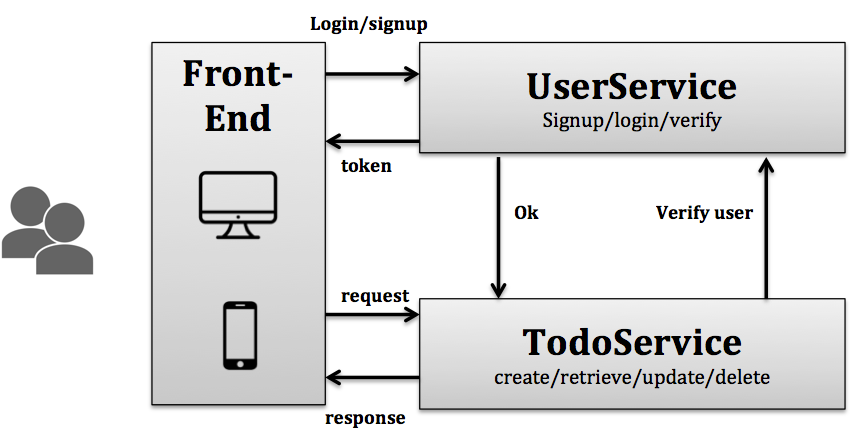

# Micro services

This open source project aims to show case the interaction between two micro services: UserService and TodoService.

The two services will not be sharing any data hence have to commnuicate through API endpoints. For example when getting the list of tasks for a user, the **Todo service** can verify the user requesting the information via the **User service**.

[Django Rest Framework] (http://www.django-rest-framework.org/) (DRF) will intensively be used in this project for :

*	Views implementation (Class Based Views),
*	Authentification: Generating and managing tokens
*	Serializers design

## Table of content

[Architecture](#architecture)

[User Service](#userservice)

[Todo Service](#todoservice)

[Installation and Continuous Integration (CI)](#installation)

[Licensing](#license)

[Reporting Issues](#issues)

## Architecture:

 **Fig.1: Architecture of the microservice system** 

Figure 1 depicts the architecture of the micro service system allowing users to manipulate their todo lists. Users interacts wiuth the syste using any front-end application (mobile, desktop). 

## User service:

[Documentation](docs/users_api.md)

The user service allows users to signup and login to the system. When a user login a token is generated and stored for her/him, that token will then be used by other microservices to identify each user.

The user model is merely the default Django's user model, this model could be easily extended by associating a Profile model to it.

Clients (mobile, desktop,...) required a token in order to be allowed to access teh UserService. 

DRF was is therefore used to easily generate tokens, a lot of libraries that achieve the same goal exist, DRF was choosen in order to limit the number of external modules used in this project.

## Todo Service:

[Documentation](docs/todo_api.md)

A simple model for the Todo was chosen, it is comprised of the following firlds: 

- **description**: is a string that describes the task that has to be, 
- **due_at**: is a date that specifies the deathline for the current task,
- **completed**: is a boolean that specifies whether the task is completed or not,
- **author**: is a string that is automatically generated using the token that is passed when creating a task. The TodoService retrieves the user linked to that token from the UserService.

A custom middleware is created to enrich the incoming requests with the complete user information (username, user id, first name, last name,...)

    todo_service.middleware.auth.CustomAuthMiddleware
    
This is where the interaction between UserService and TodoService happens

## Installation and Continuous Integration (CI)

Steps to set up the project:

Creating the virtual environment

		source bin/activate my_micro_env

Installing the dependencies

		pip install -r user_service/requirements.txt
		
		pip install -r todo_service/requirements.txt
		

Creating the required databases

		user_service/manage.py syncdb
		
		todo_service/manage.py syncdb
		

Loading test data

In the user microservice directory:
		
		./manage.py loaddata testdata/users.json

In the todo microservice directory:
		
		./manage.py loaddata testdata/todo.json
				
Running tests:
		
		user_service/manage.py test user_app
		
		todo_service/manage.py test todo_app
		
NB: To run the tests on TodoService, the UserServioce has to be running on the port 5000.
 
		user_service/manage.py runserver 5000
		
This will allow the verification of tokens

Django Nose is used to run the tests

**PyLint** is used for code analysis

**Travis-CI** is used for continuous integration, the configuration can be found in 

		.travis.yml

##Licensing

This project uses the [Apache License, version 2.0](http://www.apache.org/licenses/LICENSE-2.0.html)

##Reporting Issues

If you have bugs or other issues, feel free to report them [here](https://github.com/ptchankue/microservices/issues)

# Dockerizing the project to ease the execution

